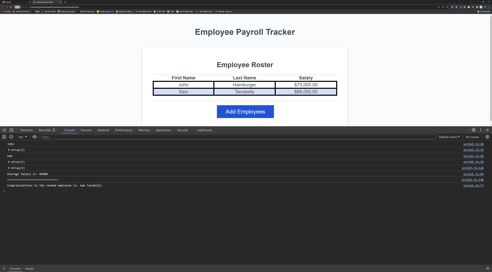

# 03_javaScript_homework

## Description

This application takes employee payroll data and complies it in a list, while calucating additional information (e.g., average salary, random employee winner, etc.) that can be found in the console. The intention of this project was to teach the use of javaScript arrays, methods, for loops, events listeners, all of which are modes of designing and displaying data on a DOM using javaScript. 

## Usage

  
    
  

## Credits

I would like to thank both the Northwestern bootcamp professor, as well as some of the tutor staff for completing this project. Also the w3school resource, mostly on the hover and container css elements.

## Badges

N/A

## Features

When oepning the Employee Payroll tracker, the user will enter information as follows: first name, last name then salary (all of which is prompted upon opening the application).

Once this information is entered, data will agrigate and display the information and calcations within the console elements.

## How to Contribute

N/A

## Tests

N/A
